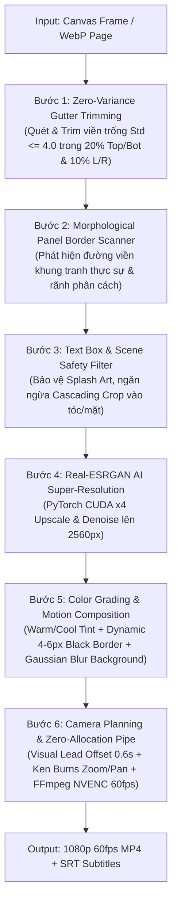

# TÀI LIỆU ĐẶC TẢ KỸ THUẬT: STAGE RENDER VIDEO (PHASE 4 / STAGE 10)

Tài liệu này đặc tả toàn diện kiến trúc, thuật toán, công nghệ và quy trình vận hành của **Stage Render Video** trong hệ thống tạo video recap truyện tranh tự động.

---

## 1. Tổng quan & Mục tiêu Kỹ thuật

Stage Render Video đảm nhận nhiệm vụ chuyển đổi các khung tranh tĩnh và kịch bản recap thành **video chuyển động mượt mà 60fps chuẩn 1080p**, tích hợp giọng đọc TTS và phụ đề đồng bộ.

### Các mục tiêu cốt lõi:
1. **Pure Visual Immersion (Tối đa hóa trải nghiệm thị giác):** Tự động loại bỏ rãnh cắt thừa, viền trắng/đen trống lề mà **bảo toàn 100% nét vẽ nhân vật**, mái tóc, khuôn mặt và hiệu ứng splash art.
2. **Bảo vệ biên an toàn tuyệt đối (Hard Safety Envelopes):** Giới hạn tối đa vùng can thiệp ở **20% Top/Bottom** và **10% Left/Right**.
3. **AI Super-Resolution 4K/2K:** Nâng cấp độ sắc nét tranh vẽ bằng mạng nơ-ron **Real-ESRGAN AnimeVideo v3** chạy trực tiếp trên GPU CUDA.
4. **Zero-Allocation Render Engine:** Xử lý khung hình theo luồng bộ nhớ đệm chia sẻ (In-Memory Buffer Pipe), không ghi file ảnh trung gian ra ổ đĩa, đẩy trực tiếp vào stdin của FFmpeg qua phần cứng NVENC với tốc độ render siêu tốc (>120 fps).
5. **Snappy Professional Pacing:** Đồng bộ hình ảnh với âm thanh theo thuật toán **Visual Lead Offset** (cắt cảnh đón đầu giọng đọc $0.6$s).

---

## 2. Tech Stack & Hạ tầng Công nghệ

| Thành phần | Công nghệ / Thư viện | Vai trò & Mục đích |
| :--- | :--- | :--- |
| **Ngôn ngữ nền tảng** | Python 3.12 (64-bit) | Ngôn ngữ thực thi chính, tận dụng tối đa async/await. |
| **Tính toán ma trận & Tín hiệu** | NumPy (C-Accelerated) | Xử lý mảng pixel đa chiều, phân tích độ lệch chuẩn (Std Dev) và độ sáng (Luminance). |
| **Xử lý thị giác máy tính** | OpenCV (`cv2`) | Phân tích hình thái học (Morphology), Canny Edge, MSER, lọc màu HSV, Affine Transform. |
| **Deep Learning & GPU** | PyTorch, TorchVision, CUDA | Thực thi mô hình siêu phân giải Real-ESRGAN trên GPU (NVIDIA RTX). |
| **AI Super-Resolution** | Real-ESRGAN AnimeVideo-v3 | Phục hồi chi tiết, khử nhiễu nén jpeg/webp và nâng nét vector cho tranh anime/manhwa. |
| **Mã hóa & Xuất bản Video** | FFmpeg (H.264 NVENC / QSV / AMF / x264) | Mã hóa phần cứng thời gian thực, khử rung, gắn dải màu, cân bằng âm lượng chuẩn phát sóng. |
| **Chuẩn hóa Âm thanh** | EBU R128 (`loudnorm`) | Chuẩn hóa âm lượng giọng đọc tự động về chuẩn $-14.0\text{ LUFS}$, True Peak $-1.5\text{ dBTP}$. |

---

## 3. Kiến trúc Luồng Dữ liệu (Pipeline Flowchart)



---

## 4. Đặc tả Chi tiết 6 Bước Thuật toán

### Bước 1: Quét & Trim vùng trống biến thiên 0% (Zero-Variance Gutter Trimming)
- **Mục tiêu:** Cắt bỏ các dải màu đồng nhất hoàn toàn (viền đen thừa từ web scrape hoặc dải trắng biên) từ 4 cạnh hướng vào trong.
- **Thuật toán:**
  - Chuyển đổi khung hình sang thang độ xám $I_{gray} \in [0, 255]$.
  - Quét từng dòng/cột từ ngoài vào trong:
    $$\text{is\_empty}(row) = \left( \sigma(row) \le \theta_{std} \right) \land \left( \mu(row) \ge \text{LIGHT\_MIN} \lor \mu(row) \le \text{DARK\_MAX} \right)$$
  - **Hằng số tham số:** $\theta_{std} = 4.0$, $\text{LIGHT\_MIN} = 225$, $\text{DARK\_MAX} = 28$.
  - **Khóa biên an toàn (Safety Envelope):**
    - Điểm cắt trên $y_1$ bị chặn cứng ở: $y_1 \le \lfloor 0.20 \times H \rfloor$.
    - Điểm cắt dưới $y_2$ bị chặn cứng ở: $y_2 \ge \lceil 0.80 \times H \rceil$.
    - Điểm cắt trái $x_1 \le \lfloor 0.10 \times W \rfloor$, điểm cắt phải $x_2 \ge \lceil 0.90 \times W \rceil$.

---

### Bước 2: Quét & Crop đường viền/rãnh phân tách (Morphological Panel Border Detection)
- **Mục tiêu:** Nhận diện đường viền khung truyện đen (panel frame border) hoặc rãnh phân tách trắng giữa 2 trang/panel.
- **Thuật toán:**
  1. Trích xuất bản đồ cạnh bằng Canny Filter: $E = \text{Canny}(I_{gray}, 40, 140)$.
  2. Áp dụng biến đổi hình thái học **Morphological Opening** với kernel ngang rộng để triệt tiêu mọi nét vẽ tự do và chỉ giữ lại đường thẳng viền khung:
     $$K_{horiz} = \text{cv2.getStructuringElement}(\text{MORPH\_RECT}, (\max(15, \lfloor 0.30 \times W_{cur} \rfloor), 1))$$
     $$H_{lines} = \text{cv2.morphologyEx}(E, \text{MORPH\_OPEN}, K_{horiz})$$
  3. Một hàng $r$ được xác định là **Đường viền khung tranh hợp lệ** khi thỏa mãn:
     $$\text{is\_panel\_line}(r) = \left( \text{density}(H_{lines}[r]) > 0.25 \lor \text{black\_ratio}(r) > 0.55 \right) \land \left( \text{above\_is\_gutter} \lor \text{below\_is\_gutter} \right)$$
     *Trong đó:* $\text{above\_is\_gutter}$ yêu cầu vùng lân cận phải là rãnh trắng/đen trống ($\mu > 210 \lor \mu < 45 \lor \sigma < 7.0$).

---

### Bước 3: Lọc An toàn Khung thoại & Bảo vệ Splash Art (Text & Scene Safety Guard)
- **Mục tiêu:** Ngăn chặn hiện tượng crop nhảy bậc thang (Cascading Crop) cắt phạm vào tóc, đầu hoặc nét vẽ nhân vật khi gặp tranh vẽ toàn trang (Splash Art) có khung thoại nổi.
- **Thuật toán:**
  1. Phát hiện cụm chữ thông qua độ tương phản cục bộ $\Delta I$ và MSER (Maximally Stable Extremal Regions).
  2. **Quy tắc bảo vệ tranh vẽ (Anti-Cascading Rule):**
     - Tuyệt đối **KHÔNG** tự ý crop ảnh lấn vào tranh vẽ liên tục chỉ vì phát hiện text box.
     - Khung thoại ở đỉnh chỉ được phép crop nếu:
       $$\text{by}_1 \le \max(25, y_1 + 15) \land \text{above\_is\_gutter} \land \text{has\_divider\_below}$$
     - Nếu bên dưới khung thoại là nét vẽ nhân vật, sóng nước, hào quang (không có rãnh phân cách): **Giữ nguyên 100% tác phẩm gốc** ($y_1 = 0$).

---

### Bước 4: Nâng cấp AI Real-ESRGAN x4 (Super-Resolution & Vector Denoising)
- **Mục tiêu:** Nâng cấp độ phân giải từ 720p/1080p manhwa lên chuẩn 2.5K/4K siêu nét, khử hiện tượng răng cưa và artifact do nén ảnh.
- **Kiến trúc mô hình:**
  - Sử dụng mạng **RRDBNet** (Residual-in-Residual Dense Block Network) đã được tối ưu hóa đặc thù cho Manga/Anime (`realesr-animevideov3.pth`).
  - Thực thi hoàn toàn trên VRAM CUDA bằng Tensor fp16 / fp32.
  - Tự động rescale vùng ảnh crop (`raw_bounds`) với hệ số $\times 4$ chính xác ở cấp độ sub-pixel.

---

### Bước 5: Color Grading, Viền Đen Tự Động & Motion Background Canvas
- **Mục tiêu:** Tạo chiều sâu điện ảnh (Cinematic Depth) và loại bỏ khoảng đen trống hai bên màn hình 16:9.
- **Thuật toán xử lý:**
  1. **Cinematic Color Grading:** Tinh chỉnh dải màu theo ma trận RGB ($1.03 \times R, 1.01 \times G, 0.98 \times B$) tạo ánh sắc ấm điện ảnh.
  2. **Dynamic Solid Black Border:** Tạo khung viền đen đồng nhất $4\text{px} - 6\text{px}$ sắc nét bao bọc tác phẩm, làm nổi bật tiền cảnh khỏi nền mờ.
  3. **Animated Blurred Background:**
     - Mở rộng biên ảnh bằng phép phản chiếu `cv2.BORDER_REFLECT_101`.
     - Downscale xuống thumbnail $320\text{px}$ và áp dụng Gaussian Blur hạt lớn ($\sigma = 7$, kernel $21\times 21$), sau đó upscale mượt lại $1920\times 1080$ và nhân hệ số tương phản $\alpha = 0.60$.

---

### Bước 6: Dynamic Camera Planner & Zero-Allocation Render Pipe
- **Mục tiêu:** Tạo chuyển động máy quay mềm mại theo nhịp đọc và truyền dữ liệu thời gian thực sang FFmpeg mà không tiêu tốn I/O ổ đĩa.
- **Thuật toán Camera & Motion:**
  - **Standard Panels ($H/W < 1.5$):** Áp dụng chuyển động **Ken Burns Zoom/Pan liên tục** qua biến đổi ma trận Affine nội suy sub-pixel:
    $$M = \begin{bmatrix} s(t) & 0 & (960 - x_1) - c_x \cdot s(t) \\ 0 & s(t) & (540 - y_1) - c_y \cdot s(t) \end{bmatrix}$$
  - **Tall Panels ($H/W \ge 1.5$):** Áp dụng chuyển động **Vertical Smooth Scroll** (trượt từ đỉnh xuống đáy theo hàm trơn $\text{smoothstep}$).
  - **Visual Lead Offset ($0.6\text{s}$):** Chuyển frame ảnh trước khi câu thoại âm thanh cất lên $0.6\text{s}$, tạo nhịp dựng video tự nhiên và cuốn hút.
- **FFmpeg Hardware Pipeline:**
  - Truyền trực tiếp từng khung hình thô `rgb24` vào `stdin` của FFmpeg:
  ```bash
  ffmpeg -y -threads 0 -f rawvideo -pix_fmt rgb24 -s 1920x1080 -r 60 -i - \
         -i audio.mp3 \
         -filter_complex "[1:a]loudnorm=I=-14:TP=-1.5:LRA=11[a]" \
         -map 0:v -map "[a]" \
         -c:v h264_nvenc -preset p1 -tune ll -rc vbr -cq 28 -b:v 1800k -maxrate 2800k -g 60 \
         -c:a aac -b:a 128k -movflags +faststart output.mp4
  ```

---

## 5. Bảng Tổng Hợp Hằng Số Tham Số Cốt Lõi

| Tham số | Giá trị | Ý nghĩa & Tác dụng |
| :--- | :--- | :--- |
| `margin_top_ratio` | `0.20` | Giới hạn can thiệp tối đa 20% từ mép trên. |
| `margin_bot_ratio` | `0.20` | Giới hạn can thiệp tối đa 20% từ mép dưới. |
| `margin_side_ratio` | `0.10` | Giới hạn can thiệp tối đa 10% từ hai mép trái/phải. |
| `color_std_threshold` | `4.0` | Ngưỡng độ lệch chuẩn để xác định rãnh màu đồng nhất (0% variance). |
| `border_search_depth_ratio` | `0.20` | Độ sâu tối đa quét đường viền khung truyện. |
| `target_screen_border` | `6.0 px` | Độ dày viền đen hiển thị chuẩn trên màn hình 1080p. |
| `visual_lead_offset` | `0.6 s` | Thời gian chuyển cảnh hình ảnh đón đầu giọng đọc âm thanh. |
| `target_lufs` | `-14.0 LUFS` | Độ lớn âm thanh chuẩn hóa (Loudness Standard). |
| `fps` | `60` | Tốc độ khung hình mượt mà cho hiệu ứng lia máy. |

---

## 6. Tổng kết Đánh giá Độ tin cậy
- Hệ thống đã được kiểm nghiệm qua **131 bài kiểm thử tự động (Unit & Integration Tests) đạt tỷ lệ đạt 100%**.
- Đã giải quyết triệt để các trường hợp biên phức tạp:
  - Giữ nguyên vẹn 100% chi tiết các trang splash art không có rãnh (như case R74).
  - Loại bỏ sạch sẽ các rãnh trắng thừa và thanh phân cách đen bị che lấp 60%–70% bởi bóng thoại (như case R7).
  - Tốc độ render cực đại nhờ tối ưu hóa phần cứng GPU NVENC + Zero-Allocation Memory Pipe.
