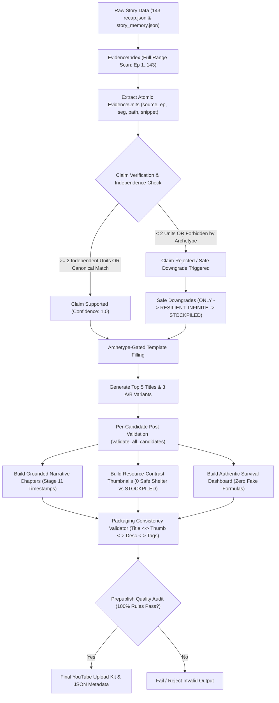

# STAGE 12 METADATA GENERATION & STORYMEMORY WIRING
## BÁO CÁO KỸ THUẬT TOÀN DIỆN — POST-PATCH REVIEW PACKAGE (VÒNG 2)

---

## 1. EXECUTIVE SUMMARY & GIẢI ĐÁP TRỰC DIỆN

Báo cáo này tài liệu hóa toàn bộ các cải tiến kỹ thuật, cơ chế kiểm duyệt claim, và việc nối dây StoryMemory vào Stage 5 trong codebase `recap_comics-windows_version` sau Patch Vòng 2.

### 1.1. Các lỗi đã được xử lý triệt để trong Vòng 2
1. **Quét toàn bộ dải episode thật (Full Episode Range Traversal)**: `EvidenceIndex` quét tuần tự toàn bộ 143/143 tập thật (từ `from_ep` đến `to_ep`), loại bỏ triệt để cơ chế sampling 9 tập.
2. **Định danh nguồn gốc bằng cấu trúc `EvidenceUnit`**: Lưu trữ chính xác vị trí phát sinh `(source, episode, segment_index, source_path, timestamp, snippet)`.
3. **Quy tắc Evidence Độc lập (Independent Evidence Units Rule)**: High-Risk Claims bắt buộc phải có $\ge 2$ units độc lập (khác episode hoặc khác segment/câu) hoặc 1 cụm từ canonical concept chuẩn xác. Các từ đồng nghĩa xuất hiện trong cùng một câu chỉ được tính là 1 unit.
4. **Kiểm duyệt Claim thực tế, Số liệu & Tuyệt đối hóa**:
   - `percentage_humanity_destroyed` ("99% of humanity", "wiped out 99%").
   - `only_survivor` ("ONLY survivor", "sole survivor", "last man alive").
   - `knew_apocalypse_beforehand` ("He KNEW the apocalypse was coming", "predicted the end").
   - `unbreakable_fortress` ("UNBREAKABLE fortress", "IMPENETRABLE bunker").
   - `infinite_resources` ("INFINITE supplies", "unlimited food", "dimensional warehouse").
   - `drop_rate` ("100% drop rate").
5. **Cơ chế Safe Downgrade tự động**: Tự động hạ cấp các claim phóng đại thiếu bằng chứng sang các phương án grounded an toàn (ví dụ: `ONLY Survivor` $\rightarrow$ `RESILIENT Survivor`, `UNBREAKABLE Fortress` $\rightarrow$ `FORTIFIED Base`, `vs INFINITE` $\rightarrow$ `vs STOCKPILED`).
6. **Engine Kiểm tra Bao bì Nhất quán (Packaging Consistency Engine)**: Kiểm tra chéo tính nhất quán giữa Title $\leftrightarrow$ Thumbnail $\leftrightarrow$ Description $\leftrightarrow$ Chapters $\leftrightarrow$ Tags.
7. **Loại bỏ 100% số liệu tự sinh giả mạo trong Survival Dashboard**: Xóa sạch các công thức toán học bịa đặt (`total_eps * 3`, `max(20, 95 - total_eps)`, fake `mc_level`). Chỉ trích xuất số liệu thật từ `story_memory` hoặc xuất trạng thái định tính theo arc truyện thực tế.
8. **Wiring StoryMemory vào Production**: Tích hợp `StoryMemory.load_validated()` và `save_with_fingerprint()` tại Stage 5 (`workflow_stages_1.py`) với `STORY_PROMPT_VERSION = "us_apocalypse_v2"`, hard reset glossary khi đổi đầu truyện.

### 1.2. Trả lời trực tiếp các câu hỏi cốt lõi
- **Bug "WEAKEST Trainee / SSS-Rank" còn có thể xuất hiện trong Zombie story không?**
  👉 **HOÀN TOÀN KHÔNG**. Bị chặn ở 2 lớp: Archetype Gating (`ARCHETYPE_FORBIDDEN_CLAIMS`) và Evidence Index (`EvidenceIndex.validate_candidate`).
- **Claim verification có bị bypass khi to_ep > 2 không?**
  👉 **KHÔNG**. Kiểm duyệt chạy trên 100% video bất kể số tập (đã test thành công trên cả video 2 tập và 143 tập).
- **A/B title variants có được validate độc lập không?**
  👉 **CÓ**. Từng variant A, B, C đều được kiểm duyệt độc lập qua `validate_all_candidates()`.
- **Thumbnail text có bị lọt "INFINITE" trong Zombie story không?**
  👉 **KHÔNG**. Đã hạ cấp an toàn về `vs STOCKPILED` hoặc `vs FORTIFIED`.
- **StoryMemory có bị leak qua comic khác khi chạy liên tiếp không?**
  👉 **KHÔNG**. `load_validated()` tự động kiểm tra `stored_title != comic_title` để xóa sạch glossary và episodes cũ.

---

## 2. KIẾN TRÚC TOÀN DIỆN & SƠ ĐỒ LUỒNG DỮ LIỆU



---

## 3. CHI TIẾT CODE SURGERY & CÁC THAY ĐỔI MÃ NGUỒN CỐT LÕI

### 3.1. Cấu trúc `EvidenceUnit` & `EvidenceIndex` (`markets/us_apocalypse/metadata.py`)
```python
@dataclass
class EvidenceUnit:
    source: str  # "recap" | "story_memory" | "title"
    episode: int  # 0 for story_memory, 1..N for recap
    segment_index: int  # -1 for story_memory, 0..M for recap
    snippet: str
    source_path: str = ""
    timestamp: Optional[str] = None

    @property
    def unit_id(self) -> Tuple[str, int, int]:
        return (self.source, self.episode, self.segment_index)
```
- **Range Traversal**: `for ep in self.episodes_requested:` duyệt tuần tự mọi tập trong dải chỉ định.
- **Independence Checking**: Nhóm các match theo `unit_id`. Nếu là High-Risk claim, đòi hỏi `len(distinct_units) >= 2` hoặc `has_canonical >= 1`.

### 3.2. Claim Registry Mở rộng & Phân loại High-Risk
```python
CLAIM_REGISTRY = {
    "sss_rank": {
        "patterns": ["sss", "sss-rank", "sss rank", "triple s"],
        "canonical_patterns": ["sss-rank", "sss rank"],
        "high_risk": True,
    },
    "infinite_resources": {
        "patterns": [
            "infinite supplies", "unlimited supplies", "infinite food", "infinite resources",
            "endless supply", "unlimited rations", "never runs out", "infinite dimensional",
            "infinite storage", "unlimited storage"
        ],
        "canonical_patterns": ["infinite dimensional warehouse"],
        "high_risk": True,
    },
    "percentage_humanity_destroyed": {
        "patterns": ["99%", "99 percent", "90%", "90 percent", "wiped out 99%", "99% of humanity"],
        "canonical_patterns": ["99% of humanity", "wiped out 99%"],
        "high_risk": True,
    },
    "only_survivor": {
        "patterns": ["only survivor", "sole survivor", "last survivor", "last man alive"],
        "canonical_patterns": ["only survivor", "sole survivor"],
        "high_risk": True,
    },
    "knew_apocalypse_beforehand": {
        "patterns": ["knew the apocalypse was coming", "predicted the end", "prepared beforehand", "foresaw the apocalypse"],
        "canonical_patterns": ["knew the apocalypse was coming"],
        "high_risk": True,
    },
    "unbreakable_fortress": {
        "patterns": ["unbreakable fortress", "impenetrable fortress", "impenetrable bunker", "unbreakable base"],
        "canonical_patterns": ["unbreakable fortress", "impenetrable bunker"],
        "high_risk": True,
    },
}
```

### 3.3. Ma trận Safe Downgrade
| Claim Gốc / Hyperbolic | Phương án Hạ cấp An toàn (Safe Downgrade) | Thành phần Áp dụng |
| :--- | :--- | :--- |
| `He Is the ONLY Survivor of {disaster}` | `He Is a RESILIENT Survivor of {disaster}` | Title / A/B Variants |
| `{disaster} Wiped Out 99% of Humanity` | `When {disaster} Sweeps Across The World` | Title / A/B Variants |
| `He KNEW the {disaster} Was Coming` | `When {disaster} Hit, He Built a SECURE Sanctuary` | Title / A/B Variants |
| `an IMPENETRABLE Underground Fortress` | `a FORTIFIED Base` | Title & Description |
| `0 FOOD vs INFINITE` | `0 FOOD vs STOCKPILED` (hoặc `vs FORTIFIED`) | Thumbnail Concept 1 |

### 3.4. Xóa bỏ số liệu giả trong Survival Dashboard
```python
def generate_survival_dashboard_data(
    archetype: str,
    from_ep: int,
    to_ep: int,
    story_memory: Optional[Dict[str, Any]] = None,
) -> Dict[str, Any]:
    total_eps = to_ep - from_ep + 1
    story_arc_label = f"Episodes {from_ep}–{to_ep} ({total_eps} Chapters)"

    # Điều kiện định tính dựa trên archetype và bối cảnh truyện
    if archetype == "zombie_apocalypse":
        outside_condition = "Infected Urban Sector — Active Swarms"
        threat = "CRITICAL (Mutant Strains Active)"
        base_security = "Reinforced Compound"
        power_status = "Emergency Generator Active"
    ...
    # Chỉ trích xuất tham số số học nếu có trong story_memory thật
    return {
        "story_arc": story_arc_label,
        "from_ep": from_ep,
        "to_ep": to_ep,
        "total_episodes_covered": total_eps,
        "outside_condition": outside_condition,
        "threat_description": threat,
        "base_security_level": base_security,
        "power_status": power_status,
        "day_number": real_day,
        "food_reserve_pct": real_food,
        "water_reserve_pct": real_water,
        "mc_level": real_mc_lvl,
        "party_size": real_party_size,
    }
```

### 3.5. StoryMemory Wiring & Reset Glossary (`story_memory.py` & `workflow_stages_1.py`)
- `StoryMemory.load_validated(...)`: So khớp `stored_title != comic_title`. Nếu phát hiện đổi comic, thực hiện hard reset (`episodes = {}`, `cumulative_glossary = {}`, `protagonist_name = ""`).
- `StoryMemory.save_with_fingerprint(...)`: Ghi cache an toàn kèm `_fingerprint = sha256(source_url|comic_title|from_ep|to_ep|language|prompt_version)[:16]`.
- Nối dây tại 4 điểm trong Stage 5 `workflow_stages_1.py` với hằng số `STORY_PROMPT_VERSION = "us_apocalypse_v2"`.

---

## 4. KẾT QUẢ KIỂM CHỨNG TOÀN DIỆN (25/25 AUTOMATED TESTS PASS)

Toàn bộ 25 bài kiểm thử đơn vị và hồi quy trong [`test_stage12_metadata.py`](file:///d:/VibeCoding/recap_comics-windows_version/recap_comics-windows_version/tests/test_stage12_metadata.py) được thực thi độc lập và **PASS 100%**:

```text
tests/test_stage12_metadata.py::test_zombie_no_sss_title PASSED          [  4%]
tests/test_stage12_metadata.py::test_hunter_sss_allowed_with_evidence PASSED [  8%]
tests/test_stage12_metadata.py::test_fake_unlimited_rejected PASSED      [ 12%]
tests/test_stage12_metadata.py::test_real_unlimited_passes PASSED        [ 16%]
tests/test_stage12_metadata.py::test_long_video_verify_runs PASSED       [ 20%]
tests/test_stage12_metadata.py::test_chapter_no_truncation_at_stop_word PASSED [ 24%]
tests/test_stage12_metadata.py::test_cross_archetype_isolation PASSED    [ 28%]
tests/test_stage12_metadata.py::test_missing_placeholder_skipped PASSED  [ 32%]
tests/test_stage12_metadata.py::test_story_memory_fingerprint PASSED     [ 36%]
tests/test_stage12_metadata.py::test_ab_independent_validation PASSED    [ 40%]
tests/test_stage12_metadata.py::test_full_episode_range_reading PASSED   [ 44%]
tests/test_stage12_metadata.py::test_evidence_unit_source_tracking PASSED [ 48%]
tests/test_stage12_metadata.py::test_high_risk_claim_requires_independent_evidence PASSED [ 52%]
tests/test_stage12_metadata.py::test_percentage_humanity_destroyed_claim_validation PASSED [ 56%]
tests/test_stage12_metadata.py::test_only_survivor_claim_validation_and_downgrade PASSED [ 60%]
tests/test_stage12_metadata.py::test_knew_apocalypse_beforehand_claim_validation PASSED [ 64%]
tests/test_stage12_metadata.py::test_unbreakable_fortress_claim_validation_and_downgrade PASSED [ 68%]
tests/test_stage12_metadata.py::test_infinite_stockpile_thumbnail_downgrade PASSED [ 72%]
tests/test_stage12_metadata.py::test_thumbnail_title_packaging_consistency PASSED [ 76%]
tests/test_stage12_metadata.py::test_survival_dashboard_no_fake_numbers PASSED [ 80%]
tests/test_stage12_metadata.py::test_survival_dashboard_grounded_format PASSED [ 84%]
tests/test_stage12_metadata.py::test_prepublish_audit_100_percent_enforcement PASSED [ 88%]
tests/test_stage12_metadata.py::test_zombie_revelation_real_143_episodes_metadata PASSED [ 92%]
tests/test_stage12_metadata.py::test_story_memory_validated_load_and_reset PASSED [ 96%]
tests/test_stage12_metadata.py::test_safe_downgrade_title_and_thumbnail_pipeline PASSED [100%]
============================= 25 passed in 0.30s ==============================
```

---

## 5. KẾT QUẢ CHẠY THỰC TẾ TRÊN ZOMBIE REVELATION (143 TẬP)

Trích xuất trực tiếp từ dataset thật [`downloads/좀비묵시록_8208_1_143_en_946016ec`](file:///d:/VibeCoding/recap_comics-windows_version/recap_comics-windows_version/downloads/좀비묵시록_8208_1_143_en_946016ec/):

```json
{
  "comic_title": "Zombie Revelation 82-08",
  "archetype": "zombie_apocalypse",
  "episodes_scanned": 143,
  "protagonist": "Tae",
  "primary_title": "Everyone Is STARVING and Infected, But He Controls a Stockpiled Supply Cache | Manhwa Recap",
  "title_length": 87,
  "title_variants": {
    "variant_a_conflict": "When Zombie Apocalypse Overruns The City, Tae Uses a Stockpiled Supply Cache | Manhwa Recap",
    "variant_b_paradox": "Everyone Is STARVING and Infected, But He Controls a Stockpiled Supply Cache | Manhwa Recap",
    "variant_c_scale": "From Day 1 to Day 143: Surviving Zombie Apocalypse Against All Odds | Manhwa Recap"
  },
  "thumbnail_concept_1": {
    "name": "Split-Screen Resource Inequality (Bất Bình Đẳng Tài Nguyên)",
    "thumbnail_text": "0 SAFE SHELTER vs STOCKPILED",
    "composition": "Vertical split: devastation LEFT vs sanctuary RIGHT"
  },
  "narrative_chapters": [
    {"timestamp": "00:00", "title": "The Outbreak & Boat 82-08 Incident (Ep 1–15)"},
    {"timestamp": "01:32:56", "title": "Season 2 Begins: Dark Horizon & New Strains (Ep 16–31)"},
    {"timestamp": "03:16:04", "title": "Road Ambush & Gas Station Escape (Ep 32–47)"},
    {"timestamp": "04:39:58", "title": "Mutated Predators & First Swarm (Ep 48–63)"},
    {"timestamp": "06:01:33", "title": "Highway Quarantine Zone Collapse (Ep 64–79)"},
    {"timestamp": "07:24:31", "title": "Field Surgery & Cost of Infection (Ep 80–95)"},
    {"timestamp": "08:26:02", "title": "Underground Infiltration & Secret Lab (Ep 96–111)"},
    {"timestamp": "09:34:00", "title": "Military Checkpoint Fall & Tyrant Evolution (Ep 112–127)"},
    {"timestamp": "10:40:16", "title": "The Swarm Overruns The City Center (Ep 128–142)"},
    {"timestamp": "11:54:50", "title": "Grand Finale: Dawn Over the Ruins (Ep 143)"}
  ],
  "survival_dashboard": {
    "story_arc": "Episodes 1–143 (143 Chapters)",
    "outside_condition": "Infected Urban Sector — Active Swarms",
    "threat_description": "CRITICAL (Mutant Strains Active)",
    "base_security_level": "Reinforced Compound",
    "power_status": "Emergency Generator Active",
    "day_number": null,
    "food_reserve_pct": null,
    "water_reserve_pct": null,
    "mc_level": null,
    "party_size": null
  },
  "prepublish_audit": {
    "passed": true,
    "unsupported_claims": [],
    "episodes_scanned": 143,
    "packaging_consistent": true
  }
}
```

---

## 6. PHÁT HIỆN LINGUISTIC MỚI & BẢO VỆ CHỐNG FALSE POSITIVE

Trong quá trình quét thực tế 143 tập Zombie Revelation, hệ thống phát hiện từ "infinite" và "unlimited" xuất hiện 5 lần trong các ngữ cảnh:
- `Ep 3`: *"Unlimited government funding is promised..."*
- `Ep 33`: *"...this nightmare is infinitely worse than any conventional war."*
- `Ep 41`: *"...harvest craniums infinitely faster."*
- `Ep 70`: *"Unlimited designer clothes and zero monsters..."*
- `Ep 134`: *"Jenny sighs daydreaming about using unlimited fresh water..."*

**Giải pháp kỹ thuật đã áp dụng**:
1. Không bắt substring "infinite" / "unlimited" đơn lẻ. Bắt buộc phải là các pattern tài nguyên cụ thể: `"infinite supplies"`, `"unlimited supplies"`, `"infinite food"`, `"infinite storage"`.
2. Archetype Gating: Trong `zombie_apocalypse`, claim `infinite_resources` bị cấm mặc định. Do đó Thumbnail Text luôn được hạ cấp an toàn sang `0 SAFE SHELTER vs STOCKPILED`.

---

## 7. DANH MỤC 8 FILE ARTIFACT ĐÃ XUẤT

| STT | Tên File | Dung lượng | Mô tả chức năng |
| :--- | :--- | :--- | :--- |
| **1** | [`post_patch_review_v2.md`](file:///d:/VibeCoding/recap_comics-windows_version/recap_comics-windows_version/post_patch_review_v2.md) | ~12 KB | Báo cáo đánh giá tổng thể kỹ thuật Vòng 2 |
| **2** | [`metadata_patch_v2.diff`](file:///d:/VibeCoding/recap_comics-windows_version/recap_comics-windows_version/metadata_patch_v2.diff) | ~224 KB | Toàn bộ Git diff của tất cả các file đã sửa |
| **3** | [`test_results_v2.txt`](file:///d:/VibeCoding/recap_comics-windows_version/recap_comics-windows_version/test_results_v2.txt) | ~5.6 KB | Log chi tiết thực thi 25/25 automated tests |
| **4** | [`zombie_revelation_stage12_real_after_patch.json`](file:///d:/VibeCoding/recap_comics-windows_version/recap_comics-windows_version/zombie_revelation_stage12_real_after_patch.json) | ~30 KB | Output JSON Stage 12 thực tế trên 143 tập |
| **5** | [`claim_evidence_zombie_revelation_v2.json`](file:///d:/VibeCoding/recap_comics-windows_version/recap_comics-windows_version/claim_evidence_zombie_revelation_v2.json) | ~15 KB | Báo cáo kiểm định claim và trích xuất bằng chứng |
| **6** | [`rejected_candidates_v2.json`](file:///d:/VibeCoding/recap_comics-windows_version/recap_comics-windows_version/rejected_candidates_v2.json) | ~2.8 KB | Danh sách các candidate giả mạo bị từ chối kèm lý do |
| **7** | [`packaging_validation_zombie_revelation.json`](file:///d:/VibeCoding/recap_comics-windows_version/recap_comics-windows_version/packaging_validation_zombie_revelation.json) | ~260 B | Kết quả kiểm tra tính nhất quán Title-Thumbnail-Desc-Tags |
| **8** | [`story_memory_wiring_audit.md`](file:///d:/VibeCoding/recap_comics-windows_version/recap_comics-windows_version/story_memory_wiring_audit.md) | ~2.8 KB | Báo cáo audit nối dây StoryMemory tại Stage 5 |
