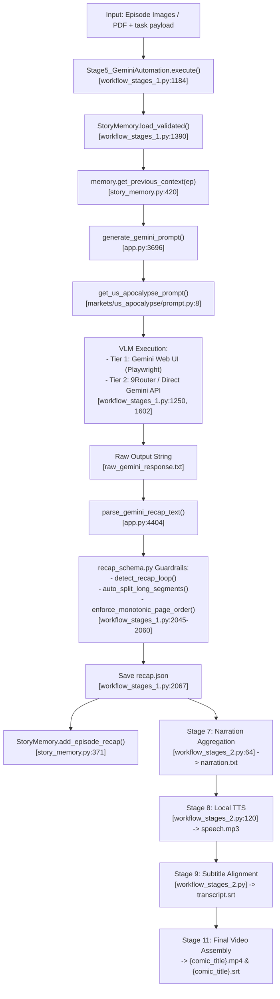

# Stage 5 Narration Pipeline Forensic Audit — V5.3 Pre-Patch Analysis

**Date:** 2026-09-28  
**Audit Scope:** Stage 5 Narration Generation End-to-End Pipeline  
**Target Comic:** Zombie Revelation 82-08 (Episodes 1–143)

---

## 1. Stage 5 Execution Flow Map

---

## 2. Component Reference & Schema Table

| Pipeline Step | Module / File Path | Class / Function | Line No. | Input Parameters | Output Schema |
|---|---|---|---|---|---|
| **1. Memory Context** | `story_memory.py` | `StoryMemory.get_previous_context()` | L420–469 | `(current_ep: int, download_dir: str)` | `Dict[str, Any]` (`cliffhanger`, `summary`, `protagonist_name`, etc.) or `None` |
| **2. Prompt Assembly** | `app.py` | `generate_gemini_prompt()` | L3696–3760 | `(comic_title, ep, total_pages, target_language, market_id, previous_context)` | `str` (formatted prompt) |
| **3. Market Prompt** | `markets/us_apocalypse/prompt.py` | `get_us_apocalypse_prompt()` | L8–289 | `(comic_title, ep, total_pages, glossary, point_score_threshold, previous_context)` | `str` (Master US Apocalypse prompt) |
| **4. VLM Inference** | `workflow_stages_1.py` | `Stage5_GeminiAutomation.process_episode_vlm()` | L1362–2150 | `(ep: int, worker)` | `raw_gemini_response.txt` |
| **5. Text Parsing** | `app.py` | `parse_gemini_recap_text()` | L4404+ | `(text: str)` | `List[Dict]` (`[{"page": int, "speech": str}]`) |
| **6. Schema Guardrails** | `recap_schema.py` | `parse_recap_data`, `detect_recap_loop`, `auto_split_long_segments` | L1–400 | `(parsed_data: list, max_page: int)` | `List[RecapSegmentItem]` |
| **7. Persistence** | `workflow_stages_1.py` | `json.dump(normalized_data)` | L2067–2071 | Normalized recap segments | `episode_{ep}/recap.json` |
| **8. Memory Update** | `story_memory.py` | `StoryMemory.add_episode_recap()` | L371–418 | `(ep, recap_data, language)` | Updated `story_memory.json` |
| **9. Aggregation** | `workflow_stages_2.py` | `Stage7_NarrationAggregation` | L64–118 | `episode_{ep}/recap.json` | `episode_{ep}/narration.txt` |
| **10. Speech TTS** | `workflow_stages_2.py` | `Stage8_LocalTTS` | L120–300 | `narration.txt`, voice settings | `episode_{ep}/speech.mp3` |
| **11. Subtitles** | `workflow_stages_2.py` | `Stage9_SubtitleNormalization` | L300–600 | `recap.json`, `speech.mp3` | `episode_{ep}/transcript.srt` |

---

## 3. Opening Hook Forensic Analysis (First 90s of Episode 1)

### Actual Output Data:
- **00:00 – 01:06 (Segments 1–10, 10 sentences, 66.08s):**
  - "Pure bedlam detonates across the city..."
  - "Screams echo down the ruined corridors..."
  - "Emergency news broadcasts urge people to lock their doors..."
  - "Static crackles over the ruined television feed..."
  - "Soldiers grimly dig into frontline barricades..."
  - "Barrels smoke and shell casings shower the pavement..."
  - "Commanders bark desperate orders..."
  - "The horde surges forward like a rabid tidal wave..."
  - "Across the smoke-choked streets, abandoned vehicles burn..."
  - "Shelters collapse beneath crushing swarms..."
- **01:06 (Segment 11, 66.08s):**
  - "Paran scans the grim devastation ahead, cold resolve settling in as the world turns upside down."

### Metric Breakdown:

| Metric | Target (Standard) | Actual Reality | Result |
|---|---|---|---|
| **Protagonist First Appearance** | 0–15 seconds (Seg 1 or 2) | 66.08 seconds (Seg 11) | ❌ **FAIL (51s delay)** |
| **Protagonist Name Accuracy** | "Tae" | "Paran" (Copied from prompt example) | ❌ **FAIL (Hallucination)** |
| **First 15s Hook Content** | Personal stakes / ability / decision | Generic crowd panic & news broadcast | ❌ **FAIL** |
| **Hook Score** | ≥ 8.5 / 10 | **2.0 / 10** | ❌ **CRITICAL RETENTION LEAK** |

---

## 4. Narration Quality Gap Report

| Prompt Rule / Golden Rule | Prompt Requirement Text (`markets/us_apocalypse/prompt.py`) | Actual Output in Real Corpus | Forensic Evaluation |
|---|---|---|---|
| **Golden Hook Rule (0–15s)** | "The opening hook (Segment 1 or 2, 0-15s) MUST explicitly introduce the protagonist by their actual name" | First 10 segments (66s) are generic crowd/military scenes. MC named in Seg 11. | ❌ **FAIL** |
| **Personality First** | "Every sentence must contain an OPINION, REACTION, or JUDGMENT... React like a sharp-witted friend" | Segments 1–10 describe background destruction in 3rd-person passive style. | ⚠️ **PARTIAL** |
| **20% Sarcastic Bro-Commentary** | "80% plot tension + 20% pragmatic wit and deadpan sarcasm" | No sarcastic remarks in the first 60 seconds; purely dark descriptive. | ⚠️ **PARTIAL** |
| **Contrast Juxtaposition** | "Outside [misery] vs Inside [MC enjoying safety/luxury]" | Only describes "Outside" collapse, no contrasting MC vantage point until much later. | ⚠️ **PARTIAL** |
| **Anti-AI Cliché Filter** | "NEVER start 3 consecutive sentences with 'He [verb]'" | Segments 11–13: "Paran scans... Looking... he knows... Step by step, he weaves...". | ✅ **PASS** (No robotic repetition) |
| **Visual Panel Selection** | "Check watermark Point >= 65" | Selected valid combat & background panels. | ✅ **PASS** |

---

## 5. Summary of Primary Bottlenecks

1. **Cold-Start Episode 1 Name Blindness:** `StoryMemory` is unaware of the comic's protagonist when `ep == 1`.
2. **Hardcoded Few-Shot Example Names:** Prompt contains static examples naming "Paran". Lacking guidance, the LLM treats "Paran" as the true protagonist name.
3. **World-First vs Character-First Pacing Bias:** The vision model starts narrating from the very first panel of page 1 (which in manhwa is almost always a wide establishing shot of the disaster or crowd), delaying the protagonist until the character appears on later pages.
