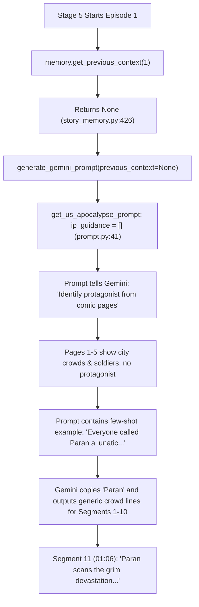

# StoryMemory → Stage 5 Narration Connection Report

**Date:** 2026-09-28  
**Audit Scope:** Stage 5 Narration Generation & StoryMemory Data Flow  
**Target Comic:** Zombie Revelation 82-08 (143 Episodes)

---

## 1. Executive Summary

Forensic tracing reveals that **StoryMemory is only partially connected to Stage 5**:
1. **Episode 1 (Cold Start Failure):** `StoryMemory.get_previous_context(1)` returns `None` by design (`story_memory.py:426`). If `task.payload` has no explicit `ip_context`, `previous_context` is `None`, leaving `ip_guidance` completely empty in `prompt.py:41`. Gemini is forced to infer the protagonist name from comic pages. In *Zombie Revelation*, pages 1–5 depict generic fleeing crowds; consequently, Gemini hallucinated the name **"Paran"** (copied directly from the prompt template's example sentences) and delayed character introduction until **Segment 11 (01:06, 66 seconds into the video)**.
2. **Episode 2+ (Binge Pacing Active):** StoryMemory successfully injects `closing_cliffhanger`, `summary`, and `protagonist_name` into `prompt.py:62-94`.
3. **Structured Facts (StoryFactGraph):** Completely **NOT CONNECTED** to Stage 5. V5.2 facts exist solely in Stage 12 for metadata post-processing.

---

## 2. Field-by-Field Trace: StoryMemory → Stage 5 Prompt

| Item | Source (`story_memory.py`) | Stage 5 Bridge (`workflow_stages_1.py`) | Prompt Destination (`markets/us_apocalypse/prompt.py`) | Ep 1 Status | Ep 2+ Status |
|---|---|---|---|---|---|
| **Protagonist Name** | Line 279 (`infer_protagonist_name`) & Line 466 | Line 1399 (`get_previous_context`) | Line 34 (`ip_guidance`) & Line 62 (`context_lines`) | ❌ **NOT CONNECTED** (None) | ✅ **CONNECTED** (`"Tae"`) |
| **Protagonist Gender** | Line 322 (`infer_protagonist_gender`) & Line 467 | Line 1399 (`get_previous_context`) | Line 70 (`context_lines`) | ❌ **NOT CONNECTED** (None) | ✅ **CONNECTED** (`"male"`) |
| **Closing Cliffhanger** | Line 401 (`extract_cliffhanger`) & Line 462 | Line 1399 (`get_previous_context`) | Line 75 & Line 93 (`BINGE TRANSITION RULE`) | ❌ **NOT CONNECTED** (N/A) | ✅ **CONNECTED** |
| **Episode Summary** | Line 402 (`extract_chapter_summary`) & Line 463 | Line 1399 (`get_previous_context`) | Line 77 (`Story Context Leading Up`) | ❌ **NOT CONNECTED** (N/A) | ✅ **CONNECTED** |
| **Macro Context** | Line 458 & Line 464 | Line 1399 (`get_previous_context`) | Line 79 (`Macro Story Arc Context`) | ❌ **NOT CONNECTED** (N/A) | ✅ **CONNECTED** |
| **Character State (HP/Gear/Level)** | Line 28 (`self.episodes`) | ❌ Not extracted | ❌ Not in prompt | ❌ **NOT CONNECTED** | ❌ **NOT CONNECTED** |
| **StoryFactGraph (V5.2 Grounding)** | `story_fact_graph.py` | ❌ Not imported | ❌ Not in prompt | ❌ **NOT CONNECTED** | ❌ **NOT CONNECTED** |

---

## 3. Deep Dive: The Episode 1 "Paran" Hallucination & Delay Bug

### Root Cause Flow:


### Direct Evidence:
1. `story_memory.py` Line 426:
   ```python
   if current_ep <= 1:
       return None
   ```
2. `markets/us_apocalypse/prompt.py` Lines 33–41:
   ```python
   if ep == 1:
       ip_guidance = []
       if previous_context:
           p_name = str(previous_context.get("protagonist_name", "")).strip()
           if p_name and len(p_name) > 2 and p_name.upper() not in ["MC", "HERO", "GUY", "BOY", "GIRL"]:
               ip_guidance.append(f'- CONFIRMED PROTAGONIST NAME: "{p_name}"...')
       ip_guidance_text = ("\n" + "\n".join(ip_guidance)) if ip_guidance else ""
   ```
   When `previous_context` is `None`, `ip_guidance_text` evaluates to `""`.
3. `markets/us_apocalypse/prompt.py` Lines 52–54:
   ```python
   * "Everyone called Paran a lunatic for spending billions hoarding 100,000 tons of food..."
   * "Betrayed and left to freeze by his own family in his past life, Paran wakes up..."
   * "When the asteroid crashed and toxic spores turned humanity into mindless zombies, they laughed at Paran's survival bunker..."
   ```
   Because Gemini had no explicit name, it latched onto the dummy name `Paran` from the few-shot examples!

---

## 4. Episode 2+ Analysis (Working Flow)

In Episode 2:
1. Stage 5 reads `story_memory.json` updated by Episode 1.
2. `StoryMemory.infer_protagonist_name` analyzed Episode 1 and stored `protagonist_name="Tae"`.
3. `get_previous_context(2)` returned:
   ```json
   {
     "previous_episode": 1,
     "closing_cliffhanger": "Cold eyes pierce the gloomy silence, fully aware the true nightmare has barely even started.",
     "summary": "Pure bedlam detonates across the city... A feral infected lunges straight for his jugular... Standing tall amid the gruesome aftermath, Paran prepares...",
     "macro_context": "",
     "protagonist_name": "Tae",
     "protagonist_gender": "male"
   }
   ```
4. Segment 1 of Episode 2 immediately opened with:
   > *"Tae knows that gloomy silence isn't peace—it's just the terrifying calm before the storm."*
5. **Conclusion:** Episode 2+ binge flow works as intended once StoryMemory is populated. The fatal retention gap is localized entirely in **Episode 1 (the first 90 seconds)**.
